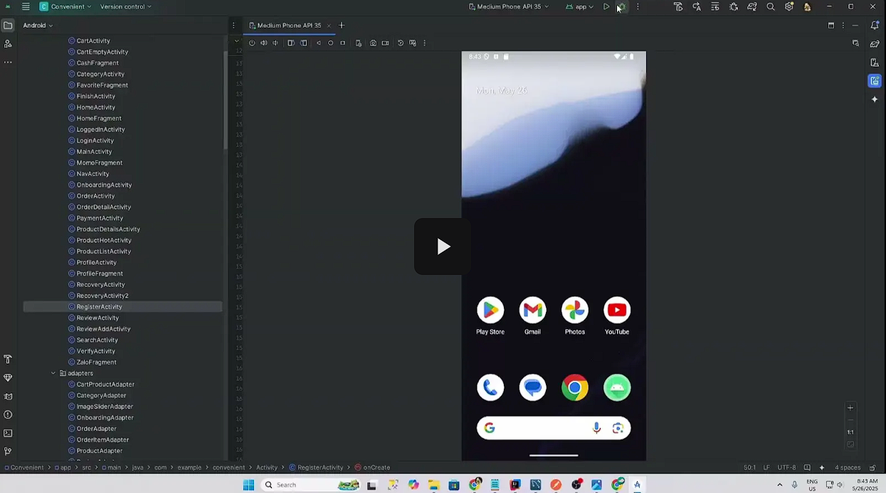

<p align="center">
  <h1 align="center">🏪 MetroMini</h1>
  <p align="center">
    A full-stack convenience store mobile application built with Android (Java) and a serverless Spring Boot backend on AWS Lambda.
  </p>
  <p align="center">
    
    
    
    
    
  </p>
</p>

---

## 📖 About

**MetroMini** is a mobile e-commerce application designed for convenience store shopping. It provides users with a seamless experience to browse products, manage their cart, apply vouchers, checkout with multiple payment methods, and track their order history — all from their Android device.

The project follows a **client-server architecture** with:
- A native **Android** front-end written in Java
- A **Spring Boot 3** REST API back-end deployed as a serverless function on **AWS Lambda** via SAM

---

## 🎬 Demo Video

[](https://drive.google.com/file/d/1Hw9k6T_SnRxMaT_knITEKtGrfqPN85YL/view?usp=drive_link)

---

## ✨ Features

### 🔐 Authentication & Account
- User registration with email verification (OTP)
- Login with email/password
- Google Sign-In integration
- Password recovery via email OTP
- Profile management (avatar, name, phone, password)

### 🛍️ Shopping
- Browse products by category (Vegetables, Fruits, Beverages, Snacks)
- View featured/hot products on the home screen
- Product detail pages with images, descriptions, and pricing
- Search products by keyword
- Add products to favorites/wishlist

### 🛒 Cart & Checkout
- Add/remove products with quantity controls
- Apply voucher/discount codes
- View subtotal, discount, and total breakdown
- Multiple payment methods: **MoMo**, **ZaloPay**, **Cash**

### ⭐ Reviews & Ratings
- View product reviews and star ratings
- Submit reviews with star rating and text comments

### 📦 Order Management
- Full order history with payment method indicators
- Detailed order view with itemized breakdown
- Order status tracking

---

## 🏗️ Architecture

```
MetroMini/
├── android-app/          # Android client (Java, View Binding)
│   └── app/
│       └── src/main/
│           ├── java/com/example/convenient/
│           │   ├── Activity/       # All Activity & Fragment classes
│           │   ├── adapters/       # RecyclerView adapters
│           │   ├── models/         # Data models (Product, Cart, Order, etc.)
│           │   └── Utils/          # Helpers (HTTP, SharedPrefs, Cookies)
│           └── res/                # Layouts, drawables, values
├── back-end/             # Spring Boot 3 serverless API
│   └── src/main/java/org/convenient/
│       ├── controller/             # MVC controllers
│       ├── rest_controller/        # REST API endpoints
│       ├── models/                 # JPA entity models
│       ├── repository/             # Spring Data JPA repositories
│       ├── services/               # Business logic layer
│       ├── security/               # JWT auth & Spring Security config
│       ├── dto/                    # Data transfer objects
│       └── config/                 # App configuration
└── screenshots/          # App UI screenshots
```

---

## 🛠️ Tech Stack

### Android Client
| Layer | Technology |
|---|---|
| Language | Java 11 |
| Min SDK | 24 (Android 7.0) |
| Target SDK | 35 |
| UI | View Binding, Material Design Components |
| Networking | OkHttp 4, Volley |
| Image Loading | Glide 4.16 |
| Navigation | Jetpack Navigation Component |
| Auth | Google Play Services Auth |
| JSON | Gson |

### Back-End
| Layer | Technology |
|---|---|
| Framework | Spring Boot 3.4.4 |
| Language | Java 21 |
| Runtime | AWS Lambda (via SAM) |
| Database | MySQL |
| Auth | Spring Security + JWT (jjwt 0.11.5) |
| Caching | Caffeine (for OTP storage) |
| Email | Spring Boot Starter Mail |
| Storage | AWS S3 (product images, avatars) |
| Monitoring | Spring Boot Actuator |

---

## 🚀 Getting Started

### Prerequisites

- [Android Studio](https://developer.android.com/studio) (latest stable)
- [JDK 21](https://adoptium.net/)
- [Maven](https://maven.apache.org/)
- [AWS CLI](https://aws.amazon.com/cli/) (configured with credentials)
- [SAM CLI](https://docs.aws.amazon.com/serverless-application-model/latest/developerguide/install-sam-cli.html)
- A running **MySQL** instance

### Back-End Setup

1. **Clone the repository**
   ```bash
   git clone https://github.com/piracyiskey/Android.git
   cd Android/back-end
   ```

2. **Configure the database**

   Update `src/main/resources/application.properties` (or `application.yml`) with your MySQL connection details.

3. **Build with SAM**
   ```bash
   sam build
   ```

4. **Run locally**
   ```bash
   sam local start-api
   ```
   The API will be available at `http://127.0.0.1:3000`.

5. **Deploy to AWS**
   ```bash
   sam deploy --guided
   ```

### Android App Setup

1. **Open the project** in Android Studio:
   ```
   File → Open → select the android-app/ directory
   ```

2. **Update the API base URL**

   Point the app's HTTP client to your deployed (or local) backend URL.

3. **Sync Gradle** and **Run** on an emulator or physical device (min API 24).

---

## 📱 Screenshots

### Onboarding
.png)

### Login & Registration
.png)

### Password Recovery
.png)

### User Profile
.png)

### Product Browsing & Favorites
.png)

### Product Details & Reviews
.png)

### Shopping Cart
.png)

### Payment & Order History
.png)

---

## 📡 API Endpoints

| Method | Endpoint | Description |
|---|---|---|
| `POST` | `/api/register` | Register a new user |
| `POST` | `/api/login` | Authenticate and receive JWT |
| `POST` | `/api/otp/*` | Send & verify OTP |
| `POST` | `/api/recovery/*` | Password recovery flow |
| `GET` | `/api/products` | List all products |
| `GET` | `/api/products/hot` | Get featured products |
| `GET` | `/api/products/{id}` | Get product details |
| `GET/POST` | `/api/cart/*` | Cart management |
| `GET/POST` | `/api/favorites/*` | Favorites/wishlist |
| `POST` | `/api/orders` | Place an order |
| `GET` | `/api/orders` | Get order history |
| `GET/POST` | `/api/ratings/*` | Product ratings & reviews |
| `PUT` | `/api/profile` | Update user profile |

---

## 📄 License

This project was developed for educational purposes.

---

<p align="center">
  Made with ❤️ by the MetroMini team
</p>